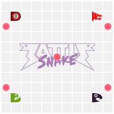

# Battlesnake

A competitive [Battlesnake](https://play.battlesnake.com) AI written in Python. It uses a multi-layered heuristic engine to evaluate moves each turn, avoiding collisions while pursuing food and board control.

> **Note:** This public repository uses a simplified reference strategy — not the full competitive logic currently running in ranked play.

<p align="center">
  
</p>

## Features

- **Heuristic Move Engine** — scores each candidate move across multiple independent criteria; the highest-scoring safe move is selected.
- **Collision Avoidance** — detects borders, snake bodies (including self), and predicts head-on collisions with larger opponents.
- **Hazard & Food Awareness** — avoids lethal hazards, de-prioritizes hazard zones, and seeks the nearest reachable food.
- **Pathfinding (BFS)** — uses breadth-first search to verify a path to the snake's own tail exists after each move, preventing self-enclosure.
- **Game Mode Support** — handles `standard`, `wrapped`, `constrictor`, and `spicy-meteors` rulesets.
- **Strategy-Switching System** — the active strategy is selected at startup via an environment variable; no code changes required to swap between strategies.
- **A/B Test Harness** — a built-in script runs two strategies against each other repeatedly and produces a results summary and CSV export.

## Architecture

```
battlesnake/
├── main.py                  # Flask server; loads strategy via STRATEGY_NAME env var
├── functions.py             # Shared heuristic primitives (avoid_borders, aim_for_food, etc.)
├── strategies/
│   ├── strategy_baseline.py # Reference strategy (thin wrapper over functions.py)
│   └── strategy_variant.py  # Starting point for a new experimental variant
├── run_ab_test.py           # A/B test harness: runs N games, tallies wins, saves CSV
└── api/
    └── index.py             # Stateless serverless entry point (same logic as main.py)
```

The server loads a strategy module at startup:

```python
strategy = importlib.import_module(f"strategies.strategy_{STRATEGY_NAME}")
```

Each strategy module exposes two things:
- `INFO` — a dict of Battlesnake metadata (color, head, tail cosmetics)
- `choose_move(game_state, wrap, constrictor) -> str` — returns the chosen move

This lets you run multiple competing strategies simultaneously on different ports without duplicating server code.

## Local Development

### 1. Setup

```bash
# Create and activate a virtual environment
python3 -m venv .venv
source .venv/bin/activate

# Install dependencies
pip install -r requirements.txt

# Install the Battlesnake CLI (requires Go)
go install github.com/BattlesnakeOfficial/rules/cli/battlesnake@latest
```

### 2. Run the Server

```bash
# Baseline strategy on port 8000 (defaults if env vars are unset)
STRATEGY_NAME=baseline PORT=8000 python main.py

# Variant strategy on a different port
STRATEGY_NAME=variant PORT=8001 python main.py
```

All available strategies live in `strategies/`. Add a new one by creating `strategies/strategy_<name>.py` with `INFO` and `choose_move` defined.

### 3. Run Test Games

With a server running, use the Battlesnake CLI:

```bash
# Headless (CLI output only)
battlesnake play -u http://localhost:8000

# ASCII board with color
battlesnake play -u http://localhost:8000 -v -c --delay 200

# Browser visualizer
battlesnake play -u http://localhost:8000 --browser --delay 200
```

### 4. Strategy vs. Strategy Match

Run two servers, then launch a match between them:

```bash
# Terminal 1
STRATEGY_NAME=baseline PORT=8000 python main.py

# Terminal 2
STRATEGY_NAME=variant PORT=8001 python main.py

# Terminal 3
battlesnake play \
  -u http://localhost:8000 -n Baseline \
  -u http://localhost:8001 -n Variant \
  --delay 400 --browser
```

### 5. A/B Test Harness

Run N automated games between the two strategies and get a summary table + CSV:

```bash
# Quick 5-game smoke test
python run_ab_test.py 5

# Full 100-game batch (default)
python run_ab_test.py
```

Results are saved to `ab_results/ab_test_<timestamp>.csv`.

## Live Snake

You can watch or challenge the live ranked snake on the official platform:  
[play.battlesnake.com/profile/davisstanko](https://play.battlesnake.com/profile/davisstanko)

## License

This project is licensed under the [GPL-3.0](LICENSE.md) GNU General Public License — see [LICENSE.md](LICENSE.md) for details.
